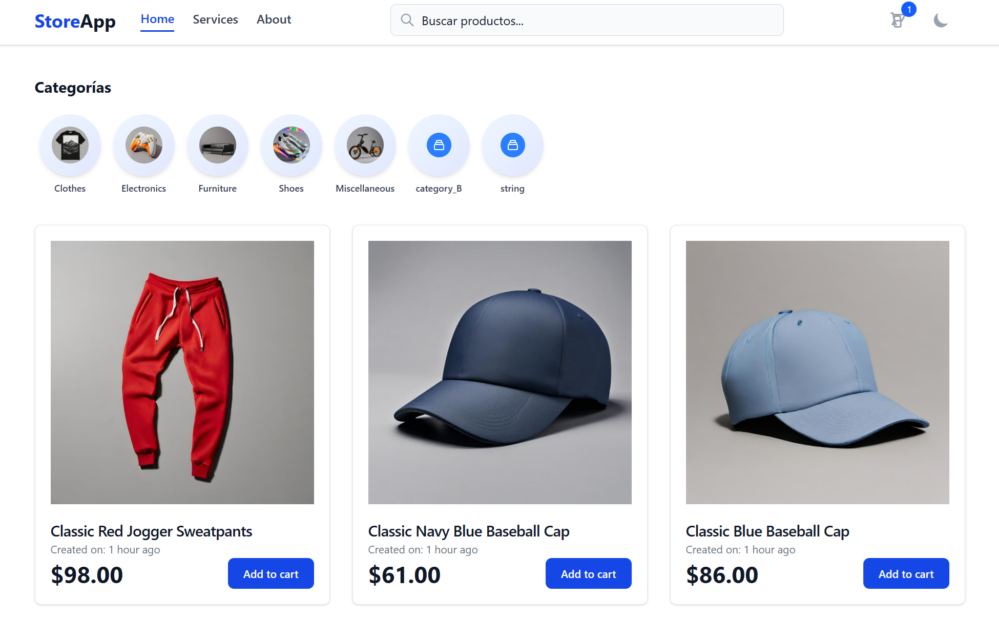

# Store App Angular 17

<div align="center">
  
</div>

Una aplicación moderna de e-commerce construida con Angular 17 usando componentes standalone, Tailwind CSS y arquitectura basada en signals.

## 🚀 Características

- **Angular 17** con componentes standalone
- **Signals** para manejo de estado reactivo
- **Tailwind CSS** para estilos modernos y responsivos
- **Arquitectura modular** con lazy loading
- **Carrito de compras** funcional
- **Filtrado por categorías** dinámico
- **Reproductor de audio** con WaveSurfer.js
- **API externa** (EscuelaJS) para datos de productos

## 🛠️ Tecnologías

- **Frontend**: Angular 17.3, TypeScript 5.4, RxJS 7.8
- **Estilos**: Tailwind CSS 4.1, PostCSS
- **Audio**: WaveSurfer.js 7.10
- **API**: EscuelaJS API REST
- **Build**: Angular CLI 17.3

## 📁 Estructura del Proyecto

```
src/app/
├── core/                    # Modelos y utilidades core
│   └── models/             # Interfaces de datos
├── features/               # Funcionalidades específicas
│   ├── info/              # Páginas informativas
│   └── products/          # Gestión de productos
└── shared/                # Componentes y servicios compartidos
    ├── components/        # Componentes reutilizables
    ├── directives/        # Directivas personalizadas
    ├── pipes/            # Pipes personalizados
    └── services/         # Servicios globales
```

## 🏃‍♂️ Inicio Rápido

### Instalación

```bash
npm install
```

### Desarrollo

```bash
npm start
# Aplicación disponible en http://localhost:4200
```

### Build de Producción

```bash
npm run build
```

## ⚡ Funcionalidades Principales

### 🛍️ Catálogo de Productos

- Lista de productos con imágenes y información detallada
- Vista de detalle individual de productos
- Sistema de categorías con filtrado dinámico

### 🛒 Carrito de Compras

- Agregar productos al carrito
- Gestión de cantidades
- Cálculo automático de totales

### 🎵 Reproductor de Audio

- Componente personalizado con WaveSurfer.js
- Visualización de ondas de audio
- Controles de reproducción

### 🎨 Interfaz de Usuario

- Diseño responsivo con Tailwind CSS
- Modo oscuro y claro
- Navegación activa con RouterLinkActive
- Efectos visuales modernos

## 🔧 Scripts Disponibles

| Script          | Descripción              |
| --------------- | ------------------------ |
| `npm start`     | Servidor de desarrollo   |
| `npm run build` | Build de producción      |
| `npm run watch` | Build en modo watch      |
| `npm test`      | Ejecutar tests unitarios |

## 📡 API Externa

El proyecto consume la API de EscuelaJS para obtener datos de productos y categorías:

- **Base URL**: https://api.escuelajs.co/api/v1
- **Endpoints**: `/products`, `/categories`

## 🎯 Características Técnicas

- **Lazy Loading**: Carga diferida de componentes
- **Path Mapping**: Alias para imports limpios (@core, @features, @shared)
- **TypeScript Strict**: Configuración estricta para mejor calidad de código
- **Signals**: Estado reactivo nativo de Angular
- **Computed Values**: Cálculos derivados automáticos
